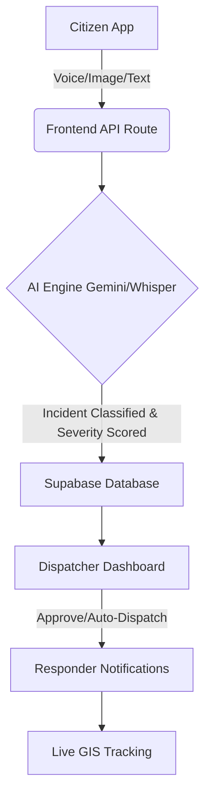

<div align="center">
  <!--  -->
  

  <br/>
  <h1>🚨 RescueFlow AI</h1>
  <p><strong>From Incident Detection to Intelligent Emergency Response</strong></p>
  
  <p>
    
    
    
    
    
  </p>

  <p>
    <a href="https://vercel.com/new/clone?repository-url=https%3A%2F%2Fgithub.com%2FPiyush-3824%2FRescueFlowAI&env=GEMINI_API_KEY,NEXT_PUBLIC_SUPABASE_URL,NEXT_PUBLIC_SUPABASE_ANON_KEY&root-directory=frontend">
      
    </a>
  </p>
</div>

---

## 📖 Overview

**Every second matters during an emergency.** 
RescueFlow AI is an AI-powered Emergency Response & Incident Management Platform designed to automate emergency reporting, incident analysis, responder notification, and live monitoring. 

Traditional workflows are manual, slow, and prone to miscommunication. **RescueFlow AI** streamlines this process by automatically understanding an incident via multimodal input (Voice, Image, Text) and coordinating the response using advanced AI models.

---

## 🎯 The Problem

Emergency response systems today are largely reactive and depend heavily on manual communication:
- ❌ **Delayed reporting** due to panic or cumbersome processes.
- ❌ **Incomplete information** leading to incorrect responder dispatch.
- ❌ **Poor communication** between centralized dispatchers and on-ground units.
- ❌ **Lack of geospatial awareness** in real-time.

---

## 💡 Our Solution

RescueFlow AI provides an intelligent platform capable of analyzing incidents submitted through multiple input formats:

1. 🎙️ **Multimodal Reporting:** Users can report emergencies using voice, images, or text.
2. 🧠 **AI Triage & Analysis:** Powered by Google Gemini and OpenAI Whisper, the system instantly identifies the incident type, estimates severity, and determines required units.
3. 🗺️ **Live GIS Command Center:** Dispatchers view a real-time heatmap and track active responders.
4. 🚑 **Automated Dispatch:** Instantly notifies the closest and most relevant responder units (Police, Fire, Medical).

---

## ✨ Key Features

- **🤖 AI Incident Detection:** Automatically identifies incident types (Fire, Medical, Industrial, etc.) from images and voice transcripts.
- **📊 Severity Assessment:** Calculates a confidence score and severity level (Low, Moderate, High, Critical).
- **📍 Intelligent Location Tracking:** Captures GPS coordinates, renders an interactive heatmap, and routes responders.
- **📢 Smart Notification System:** Automated Twilio voice calls and SMS for rapid responder deployment.
- **📈 Live Analytics Dashboard:** Track incident volume, severity distribution, and response times in real-time.

---

## 🛠 Technology Stack

### Frontend (Next.js 15 App Router)
- **Framework:** Next.js, React 19, TypeScript
- **Styling:** Tailwind CSS, Framer Motion, shadcn/ui
- **Maps:** Maplibre GL

### Database & Backend
- **Database & Auth:** Supabase (PostgreSQL, RLS, Edge Auth)
- **AI Integrations:** Google Gemini API, OpenAI Whisper
- **Communications:** Twilio API (Voice & SMS)

---

## 🚀 Getting Started

### ⚡ 1-Click Deploy to Vercel

The easiest way to deploy RescueFlow AI is using the Vercel deploy button. It will automatically set the correct root directory and prompt you for the required environment variables:

1. Click the **Deploy with Vercel** button at the top of this README.
2. When prompted, enter your `GEMINI_API_KEY`, `NEXT_PUBLIC_SUPABASE_URL`, and `NEXT_PUBLIC_SUPABASE_ANON_KEY`.
3. Vercel will build and deploy the application automatically.

### 💻 Local Setup

#### 1. Clone the Repository
```bash
git clone https://github.com/Piyush-3824/RescueFlowAI.git
cd RescueFlowAI
```

### 2. Frontend Setup
```bash
cd frontend
npm install
npm run dev
```
The application will be running at `http://localhost:3000`.

### 3. Environment Variables
Create a `.env.local` in the `frontend` directory:
```env
NEXT_PUBLIC_SUPABASE_URL=your_supabase_url
NEXT_PUBLIC_SUPABASE_ANON_KEY=your_supabase_anon_key
GEMINI_API_KEY=your_gemini_key
```

*(Note: The system supports a mock-data fallback for local development if API keys are not provided).*

---

## 🔄 System Architecture



---

## 🌟 Our Vision

Our vision is to transform emergency response by enabling AI-assistance with incident detection, intelligent dispatch, and real-time coordination. RescueFlow AI aims to reduce response times, improve situational awareness, and  the support safer workplaces and communities through automation and data-driven decision-making.

<div align="center">
  <i>Developed with ❤️ by the RescueFlow AI Team.</i>
</div>  
